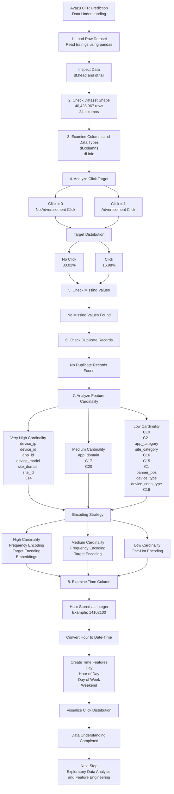

# Avazu CTR Prediction - Data Understanding Flow

```mermaid
flowchart TD

    A["Avazu CTR Prediction<br/>Data Understanding"]

    A --> B["1. Load Raw Dataset<br/>Read train.gz using pandas"]
    B --> C["Inspect Data<br/>df.head and df.tail"]

    C --> D["2. Check Dataset Shape<br/>40,428,967 rows<br/>24 columns"]

    D --> E["3. Examine Columns and Data Types<br/>df.columns<br/>df.info"]

    E --> F["4. Analyze Click Target"]

    F --> F1["Click = 0<br/>No Advertisement Click"]
    F --> F2["Click = 1<br/>Advertisement Click"]

    F1 --> G["Target Distribution"]
    F2 --> G

    G --> G1["No Click<br/>83.02%"]
    G --> G2["Click<br/>16.98%"]

    G1 --> H["5. Check Missing Values"]
    G2 --> H

    H --> H1["No Missing Values Found"]

    H1 --> I["6. Check Duplicate Records"]

    I --> I1["No Duplicate Records Found"]

    I1 --> J["7. Analyze Feature Cardinality"]

    J --> J1["Very High Cardinality<br/>device_ip<br/>device_id<br/>app_id<br/>device_model<br/>site_domain<br/>site_id<br/>C14"]

    J --> J2["Medium Cardinality<br/>app_domain<br/>C17<br/>C20"]

    J --> J3["Low Cardinality<br/>C19<br/>C21<br/>app_category<br/>site_category<br/>C16<br/>C15<br/>C1<br/>banner_pos<br/>device_type<br/>device_conn_type<br/>C18"]

    J1 --> K["Encoding Strategy"]
    J2 --> K
    J3 --> K

    K --> K1["High Cardinality<br/>Frequency Encoding<br/>Target Encoding<br/>Embeddings"]

    K --> K2["Medium Cardinality<br/>Frequency Encoding<br/>Target Encoding"]

    K --> K3["Low Cardinality<br/>One-Hot Encoding"]

    K1 --> L["8. Examine Time Column"]
    K2 --> L
    K3 --> L

    L --> L1["Hour Stored as Integer<br/>Example: 14102100"]

    L1 --> M["Convert Hour to Date-Time"]

    M --> M1["Create Time Features<br/>Day<br/>Hour of Day<br/>Day of Week<br/>Weekend"]

    M1 --> N["Visualize Click Distribution"]

    N --> O["Data Understanding Completed"]

    O --> P["Next Step<br/>Exploratory Data Analysis and Feature Engineering"]
```