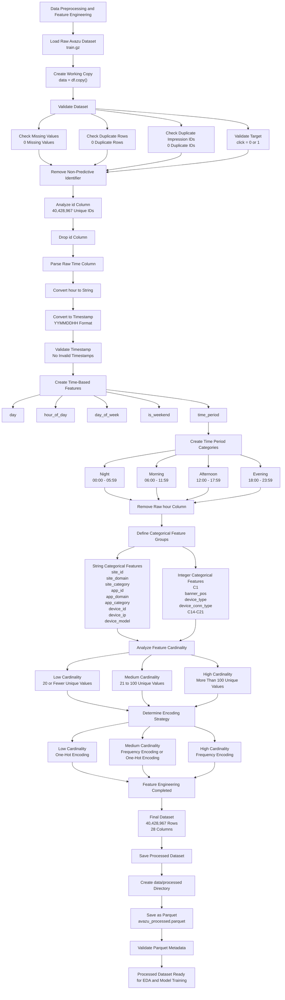

# Avazu CTR Prediction - Data Preprocessing and Feature Engineering

```mermaid
flowchart TD

    A["Data Preprocessing and Feature Engineering"]

    A --> B["Load Raw Avazu Dataset<br/>train.gz"]

    B --> C["Create Working Copy<br/>data = df.copy()"]

    C --> D["Validate Dataset"]

    D --> D1["Check Missing Values<br/>0 Missing Values"]
    D --> D2["Check Duplicate Rows<br/>0 Duplicate Rows"]
    D --> D3["Check Duplicate Impression IDs<br/>0 Duplicate IDs"]
    D --> D4["Validate Target<br/>click = 0 or 1"]

    D1 --> E["Remove Non-Predictive Identifier"]
    D2 --> E
    D3 --> E
    D4 --> E

    E --> E1["Analyze id Column<br/>40,428,967 Unique IDs"]
    E1 --> E2["Drop id Column"]

    E2 --> F["Parse Raw Time Column"]

    F --> F1["Convert hour to String"]
    F1 --> F2["Convert to Timestamp<br/>YYMMDDHH Format"]
    F2 --> F3["Validate Timestamp<br/>No Invalid Timestamps"]

    F3 --> G["Create Time-Based Features"]

    G --> G1["day"]
    G --> G2["hour_of_day"]
    G --> G3["day_of_week"]
    G --> G4["is_weekend"]
    G --> G5["time_period"]

    G5 --> H["Create Time Period Categories"]

    H --> H1["Night<br/>00:00 - 05:59"]
    H --> H2["Morning<br/>06:00 - 11:59"]
    H --> H3["Afternoon<br/>12:00 - 17:59"]
    H --> H4["Evening<br/>18:00 - 23:59"]

    H1 --> I["Remove Raw hour Column"]
    H2 --> I
    H3 --> I
    H4 --> I

    I --> J["Define Categorical Feature Groups"]

    J --> J1["String Categorical Features<br/>site_id<br/>site_domain<br/>site_category<br/>app_id<br/>app_domain<br/>app_category<br/>device_id<br/>device_ip<br/>device_model"]

    J --> J2["Integer Categorical Features<br/>C1<br/>banner_pos<br/>device_type<br/>device_conn_type<br/>C14-C21"]

    J1 --> K["Analyze Feature Cardinality"]
    J2 --> K

    K --> K1["Low Cardinality<br/>20 or Fewer Unique Values"]
    K --> K2["Medium Cardinality<br/>21 to 100 Unique Values"]
    K --> K3["High Cardinality<br/>More Than 100 Unique Values"]

    K1 --> L["Determine Encoding Strategy"]
    K2 --> L
    K3 --> L

    L --> L1["Low Cardinality<br/>One-Hot Encoding"]
    L --> L2["Medium Cardinality<br/>Frequency Encoding or One-Hot Encoding"]
    L --> L3["High Cardinality<br/>Frequency Encoding"]

    L1 --> M["Feature Engineering Completed"]
    L2 --> M
    L3 --> M

    M --> N["Final Dataset<br/>40,428,967 Rows<br/>28 Columns"]

    N --> O["Save Processed Dataset"]

    O --> O1["Create data/processed Directory"]
    O1 --> O2["Save as Parquet<br/>avazu_processed.parquet"]
    O2 --> O3["Validate Parquet Metadata"]

    O3 --> P["Processed Dataset Ready for EDA and Model Training"]
```