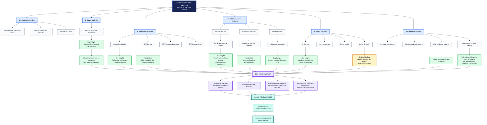

# Exploratory Data Analysis (EDA)

```mermaid
flowchart TB

    A["<b>EXPLORATORY DATA ANALYSIS</b><br/>Avazu CTR Prediction Dataset"]

    A --> B["<b>1. Data Quality Review</b>"]
    A --> C["<b>2. Target Analysis</b>"]
    A --> D["<b>3. Time-Based Analysis</b>"]
    A --> E["<b>4. Ad Environment Analysis</b>"]
    A --> F["<b>5. Device Analysis</b>"]
    A --> G["<b>6. Cardinality Analysis</b>"]

    B --> B1["Dataset shape and column review"]
    B --> B2["Missing values and duplicates"]
    B --> B3["Feature data types"]

    C --> C1["Click vs. non-click distribution"]
    C1 --> C2["<b>Key Insight</b><br/>Clicks are less frequent than non-clicks"]
    C2 --> C3["Class imbalance must be considered<br/>during model evaluation"]

    D --> D1["Impressions by hour"]
    D --> D2["CTR by hour"]
    D --> D3["CTR by day and weekday"]
    D --> D4["CTR by time period"]
    D1 --> D5["<b>Key Insight</b><br/>Traffic volume changes throughout the day"]
    D2 --> D6["<b>Key Insight</b><br/>Click probability also changes over time"]

    E --> E1["Website Features"]
    E --> E2["Application Features"]
    E --> E3["Banner Position"]

    E1 --> E11["Site ID, domain and category"]
    E2 --> E21["App ID, domain and category"]
    E3 --> E31["Ad placement analysis"]

    E11 --> E4["<b>Key Insight</b><br/>A small number of sites generate<br/>a large share of impressions"]
    E21 --> E5["<b>Key Insight</b><br/>Some applications dominate traffic"]
    E31 --> E6["<b>Key Insight</b><br/>Banner position influences CTR"]

    F --> F1["Device type"]
    F --> F2["Connection type"]
    F --> F3["Device model"]
    F --> F4["Device ID and IP"]

    F1 --> F5["<b>Key Insight</b><br/>Click behavior varies by device environment"]
    F4 --> F6["<b>Critical Finding</b><br/>96.22% of device IDs appear<br/>fewer than 10 times"]

    G --> G1["Low-cardinality features"]
    G --> G2["Medium-cardinality features"]
    G --> G3["High-cardinality features"]
    G --> G4["Anonymous C1–C21 features"]

    G3 --> G5["Millions of unique IDs and categories"]
    G4 --> G6["Analyzed using frequency and CTR patterns<br/>because business meanings are unknown"]

    C3 --> H["<b>EDA DECISION LAYER</b>"]
    D5 --> H
    D6 --> H
    E4 --> H
    E5 --> H
    E6 --> H
    F5 --> H
    F6 --> H
    G5 --> H
    G6 --> H

    H --> I["Retain time, site, app,<br/>placement and device features"]
    H --> J["Create derived time features"]
    H --> K["Use frequency encoding for<br/>high-cardinality categorical features"]
    H --> L["Use Log Loss, ROC-AUC and PR-AUC<br/>instead of accuracy alone"]

    I --> M["<b>MODEL-READY DATASET</b>"]
    J --> M
    K --> M
    L --> M

    M --> N["Time-based train,<br/>validation and test split"]
    N --> O["Baseline and advanced<br/>model training"]

    classDef main fill:#172554,stroke:#1e3a8a,stroke-width:4px,color:#ffffff;
    classDef section fill:#dbeafe,stroke:#2563eb,stroke-width:2px,color:#111827;
    classDef analysis fill:#f8fafc,stroke:#64748b,stroke-width:1.5px,color:#111827;
    classDef insight fill:#dcfce7,stroke:#16a34a,stroke-width:2px,color:#111827;
    classDef critical fill:#fef3c7,stroke:#d97706,stroke-width:3px,color:#111827;
    classDef decision fill:#ede9fe,stroke:#7c3aed,stroke-width:3px,color:#111827;
    classDef output fill:#ccfbf1,stroke:#0f766e,stroke-width:3px,color:#111827;

    class A main;
    class B,C,D,E,F,G section;
    class B1,B2,B3,C1,D1,D2,D3,D4,E1,E2,E3,E11,E21,E31,F1,F2,F3,F4,G1,G2,G3,G4 analysis;
    class C2,C3,D5,D6,E4,E5,E6,F5,G5,G6 insight;
    class F6 critical;
    class H,I,J,K,L decision;
    class M,N,O output;
```   