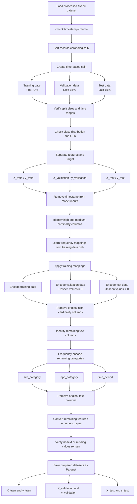

# Training Strategy

```mermaid
flowchart TD

    A[Load processed Avazu dataset] --> B[Check timestamp column]

    B --> C[Sort records chronologically]

    C --> D[Create time-based split]

    D --> D1[Training data<br/>First 70%]
    D --> D2[Validation data<br/>Next 15%]
    D --> D3[Test data<br/>Last 15%]

    D1 --> E[Verify split sizes and time ranges]
    D2 --> E
    D3 --> E

    E --> F[Check class distribution and CTR]

    F --> G[Separate features and target]

    G --> G1[X_train / y_train]
    G --> G2[X_validation / y_validation]
    G --> G3[X_test / y_test]

    G1 --> H[Remove timestamp from model inputs]
    G2 --> H
    G3 --> H

    H --> I[Identify high and medium-cardinality columns]

    I --> J[Learn frequency mappings from training data only]

    J --> K[Apply training mappings]

    K --> K1[Encode training data]
    K --> K2[Encode validation data<br/>Unseen values = 0]
    K --> K3[Encode test data<br/>Unseen values = 0]

    K1 --> L[Remove original high-cardinality columns]
    K2 --> L
    K3 --> L

    L --> M[Identify remaining text columns]

    M --> N[Frequency encode remaining categories]

    N --> N1[site_category]
    N --> N2[app_category]
    N --> N3[time_period]

    N1 --> O[Remove original text columns]
    N2 --> O
    N3 --> O

    O --> P[Convert remaining features to numeric types]

    P --> Q[Verify no text or missing values remain]

    Q --> R[Save prepared datasets as Parquet]

    R --> R1[X_train and y_train]
    R --> R2[X_validation and y_validation]
    R --> R3[X_test and y_test]
```    