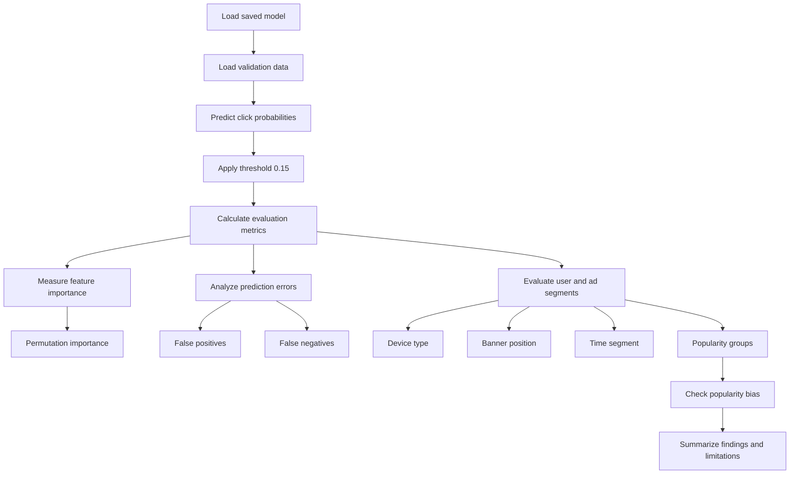

## Model Interpretation Workflow

```mermaid
flowchart TD
    A[Load saved model] --> B[Load validation data]
    B --> C[Predict click probabilities]
    C --> D[Apply threshold 0.15]
    D --> E[Calculate evaluation metrics]
    E --> F[Measure feature importance]
    E --> G[Analyze prediction errors]
    E --> H[Evaluate user and ad segments]

    F --> F1[Permutation importance]
    G --> G1[False positives]
    G --> G2[False negatives]

    H --> H1[Device type]
    H --> H2[Banner position]
    H --> H3[Time segment]
    H --> H4[Popularity groups]

    H4 --> I[Check popularity bias]
    I --> J[Summarize findings and limitations]
```