# Avazu CTR Prediction - Machine Learning Workflow

This workflow explains the machine learning approach used for the Avazu CTR prediction assignment.

The goal of this project is to predict the probability that an advertisement impression will result in a click.

The workflow covers:

- Problem framing
- Data collection and labeling
- Data understanding
- Feature engineering
- Exploratory data analysis
- Model selection
- Training strategy
- Evaluation metrics
- Model interpretation and error analysis
- Key tradeoffs

## Complete Machine Learning Workflow

```mermaid
flowchart TD

    A["Avazu CTR Prediction Assignment"]

    A --> PF1

    subgraph PF["1. Problem Framing"]

        PF1["Goal: Predict the probability of an advertisement click"]

        PF2["Machine Learning Problem: Binary Classification"]

        PF3["Probability Estimation"]

        PF4["Input Features: Site, App, Device, Placement, and Time"]

        PF5["Training Label: click"]

        PF6["click = 0: Advertisement was not clicked"]

        PF7["click = 1: Advertisement was clicked"]

        PF8["Model Output: P(click = 1)"]

        PF1 --> PF2
        PF2 --> PF3
        PF3 --> PF4
        PF4 --> PF5
        PF5 --> PF6
        PF5 --> PF7
        PF6 --> PF8
        PF7 --> PF8

    end

    PF8 --> DC1

    subgraph DC["2. Data Collection and Labeling"]

        DC1["Kaggle Avazu CTR Prediction Dataset"]

        DC2["Raw File: data/raw/train.gz"]

        DC3["40,428,967 Advertisement Impressions"]

        DC4["24 Raw Columns"]

        DC5["Each Row = One Advertisement Impression"]

        DC6["Positive Example: click = 1"]

        DC7["Negative Example: click = 0"]

        DC8["Available Data: Time, Site, App, Device, Banner Position, C Features"]

        DC9["Dataset Limitations"]

        DC10["No Separate Click Timestamp"]

        DC11["No Accidental-Click Indicator"]

        DC12["No Explicit Bot Label"]

        DC13["No Delayed-Click Metadata"]

        DC14["Use Provided Avazu Click Label"]

        DC1 --> DC2
        DC2 --> DC3
        DC3 --> DC4
        DC4 --> DC5
        DC5 --> DC6
        DC5 --> DC7
        DC6 --> DC8
        DC7 --> DC8
        DC8 --> DC9
        DC9 --> DC10
        DC9 --> DC11
        DC9 --> DC12
        DC9 --> DC13
        DC10 --> DC14
        DC11 --> DC14
        DC12 --> DC14
        DC13 --> DC14

    end

    DC14 --> DU1

    subgraph DU["3. Data Understanding"]

        DU1["Load Avazu Dataset"]

        DU2["Check Dataset Shape"]

        DU3["40,428,967 Rows"]

        DU4["Inspect Columns and Data Types"]

        DU5["Check Missing Values"]

        DU6["Check Duplicate Rows"]

        DU7["Analyze Target Distribution"]

        DU8["Non-Click: 82.5 Percent"]

        DU9["Click: 17.5 Percent"]

        DU10["Identify Feature Cardinality"]

        DU11["High-Cardinality Features"]

        DU12["Medium-Cardinality Features"]

        DU13["Low-Cardinality Features"]

        DU1 --> DU2
        DU2 --> DU3
        DU3 --> DU4
        DU4 --> DU5
        DU5 --> DU6
        DU6 --> DU7
        DU7 --> DU8
        DU7 --> DU9
        DU8 --> DU10
        DU9 --> DU10
        DU10 --> DU11
        DU10 --> DU12
        DU10 --> DU13

    end

    DU13 --> FE1

    subgraph FE["4. Feature Engineering"]

        FE1["Parse hour into timestamp"]

        FE2["Create hour_of_day"]

        FE3["Create day_of_week"]

        FE4["Create day"]

        FE5["Create is_weekend"]

        FE6["Create time_period"]

        FE7["Handle Categorical Features"]

        FE8["Frequency Encoding"]

        FE9["High and Medium Cardinality Features"]

        FE10["device_ip, device_id, app_id, device_model"]

        FE11["site_domain, site_id, C14"]

        FE12["app_domain, C17, C20"]

        FE13["Encode Remaining Text Features"]

        FE14["site_category"]

        FE15["app_category"]

        FE16["time_period"]

        FE17["Remove Original Text Columns"]

        FE18["Final Numeric Feature Dataset"]

        FE1 --> FE2
        FE2 --> FE3
        FE3 --> FE4
        FE4 --> FE5
        FE5 --> FE6
        FE6 --> FE7
        FE7 --> FE8
        FE8 --> FE9
        FE9 --> FE10
        FE9 --> FE11
        FE9 --> FE12
        FE12 --> FE13
        FE13 --> FE14
        FE13 --> FE15
        FE13 --> FE16
        FE14 --> FE17
        FE15 --> FE17
        FE16 --> FE17
        FE17 --> FE18

    end

    FE18 --> EDA1

    subgraph EDA["5. Exploratory Data Analysis"]

        EDA1["Analyze Overall CTR"]

        EDA2["CTR by Hour"]

        EDA3["CTR by Banner Position"]

        EDA4["CTR by Site Category"]

        EDA5["CTR by App Category"]

        EDA6["CTR by Device Type"]

        EDA7["CTR by Time Period"]

        EDA8["Analyze Rare Categories"]

        EDA9["96.22 Percent of Device IDs Appear Fewer Than 10 Times"]

        EDA10["Identify CTR Patterns"]

        EDA1 --> EDA2
        EDA2 --> EDA3
        EDA3 --> EDA4
        EDA4 --> EDA5
        EDA5 --> EDA6
        EDA6 --> EDA7
        EDA7 --> EDA8
        EDA8 --> EDA9
        EDA9 --> EDA10

    end

    EDA10 --> TS1

    subgraph TS["6. Training Strategy"]

        TS1["Sort Dataset by Timestamp"]

        TS2["Time-Based Split"]

        TS3["Training Data: 70 Percent"]

        TS4["Validation Data: 15 Percent"]

        TS5["Test Data: 15 Percent"]

        TS6["Training Period: Earlier Data"]

        TS7["Validation Period: Later Data"]

        TS8["Test Period: Most Recent Data"]

        TS9["Prevent Data Leakage"]

        TS10["Build Frequency Maps from Training Data Only"]

        TS11["Apply Training Maps to Validation Data"]

        TS12["Apply Training Maps to Test Data"]

        TS13["Unknown Categories = Frequency 0"]

        TS14["No Sampling for Baseline"]

        TS15["No Class Weights for Baseline"]

        TS1 --> TS2
        TS2 --> TS3
        TS2 --> TS4
        TS2 --> TS5
        TS3 --> TS6
        TS4 --> TS7
        TS5 --> TS8
        TS6 --> TS9
        TS7 --> TS9
        TS8 --> TS9
        TS9 --> TS10
        TS10 --> TS11
        TS11 --> TS12
        TS12 --> TS13
        TS13 --> TS14
        TS14 --> TS15

    end

    TS15 --> MS1

    subgraph MS["7. Model Selection"]

        MS1["Start with Baseline Model"]

        MS2["Logistic Regression"]

        MS3["Simple and Interpretable"]

        MS4["Produces Click Probabilities"]

        MS5["Evaluate Validation Performance"]

        MS6["Validation Log Loss: 0.40267"]

        MS7["Validation ROC-AUC: 0.65076"]

        MS8["Compare Advanced Models Later"]

        MS9["Decision Tree"]

        MS10["Random Forest"]

        MS11["Gradient Boosted Trees"]

        MS12["Factorization Machines"]

        MS13["Wide and Deep"]

        MS14["DeepFM"]

        MS1 --> MS2
        MS2 --> MS3
        MS2 --> MS4
        MS3 --> MS5
        MS4 --> MS5
        MS5 --> MS6
        MS5 --> MS7
        MS6 --> MS8
        MS7 --> MS8
        MS8 --> MS9
        MS8 --> MS10
        MS8 --> MS11
        MS8 --> MS12
        MS8 --> MS13
        MS8 --> MS14

    end

    MS14 --> EV1

    subgraph EV["8. Model Evaluation"]

        EV1["Predict Click Probabilities"]

        EV2["Primary Metric: Log Loss"]

        EV3["Measures Probability Quality"]

        EV4["Secondary Metric: ROC-AUC"]

        EV5["Measures Ranking Ability"]

        EV6["Precision"]

        EV7["Recall"]

        EV8["F1 Score"]

        EV9["Confusion Matrix"]

        EV10["Threshold Analysis"]

        EV11["Compare Model Results"]

        EV1 --> EV2
        EV2 --> EV3
        EV3 --> EV4
        EV4 --> EV5
        EV5 --> EV6
        EV5 --> EV7
        EV5 --> EV8
        EV5 --> EV9
        EV9 --> EV10
        EV10 --> EV11

    end

    EV11 --> MI1

    subgraph MI["9. Model Interpretation and Error Analysis"]

        MI1["Understand Feature Importance"]

        MI2["Inspect Logistic Regression Coefficients"]

        MI3["Identify Positive Click Drivers"]

        MI4["Identify Negative Click Drivers"]

        MI5["Analyze False Positives"]

        MI6["Predicted Click but Actual Non-Click"]

        MI7["Analyze False Negatives"]

        MI8["Predicted Non-Click but Actual Click"]

        MI9["Segment-Level Evaluation"]

        MI10["Site and App Categories"]

        MI11["Device Types"]

        MI12["Banner Positions"]

        MI13["Time Periods"]

        MI14["Frequent vs Rare IDs"]

        MI15["Check Popularity Bias"]

        MI16["Popular Ads"]

        MI17["Frequent Users"]

        MI18["High-Volume Categories"]

        MI1 --> MI2
        MI2 --> MI3
        MI2 --> MI4
        MI4 --> MI5
        MI5 --> MI6
        MI6 --> MI7
        MI7 --> MI8
        MI8 --> MI9
        MI9 --> MI10
        MI9 --> MI11
        MI9 --> MI12
        MI9 --> MI13
        MI9 --> MI14
        MI14 --> MI15
        MI15 --> MI16
        MI15 --> MI17
        MI15 --> MI18

    end

    MI18 --> TR1

    subgraph TR["10. Key Tradeoffs"]

        TR1["Accuracy vs Interpretability"]

        TR2["Simple Models"]

        TR3["Easy to Explain"]

        TR4["Fast to Train"]

        TR5["May Miss Complex Interactions"]

        TR6["Complex Models"]

        TR7["Capture Nonlinear Relationships"]

        TR8["Capture User-Ad Interactions"]

        TR9["Harder to Explain"]

        TR10["Higher Compute Cost"]

        TR11["Historical Click Behavior Risk"]

        TR12["Popularity Bias"]

        TR13["Feedback Loops"]

        TR14["Frequent User Bias"]

        TR15["Avoid Learning Only Popularity"]

        TR16["Use Time-Based Validation"]

        TR17["Evaluate Rare and Frequent Segments"]

        TR18["Compare Frequency Features Carefully"]

        TR19["Test Interaction-Based Models"]

        TR20["Final Model Decision"]

        TR1 --> TR2
        TR1 --> TR6
        TR2 --> TR3
        TR2 --> TR4
        TR2 --> TR5
        TR6 --> TR7
        TR6 --> TR8
        TR6 --> TR9
        TR6 --> TR10
        TR10 --> TR11
        TR11 --> TR12
        TR11 --> TR13
        TR11 --> TR14
        TR14 --> TR15
        TR15 --> TR16
        TR15 --> TR17
        TR15 --> TR18
        TR15 --> TR19
        TR16 --> TR20
        TR17 --> TR20
        TR18 --> TR20
        TR19 --> TR20

    end
``` 

